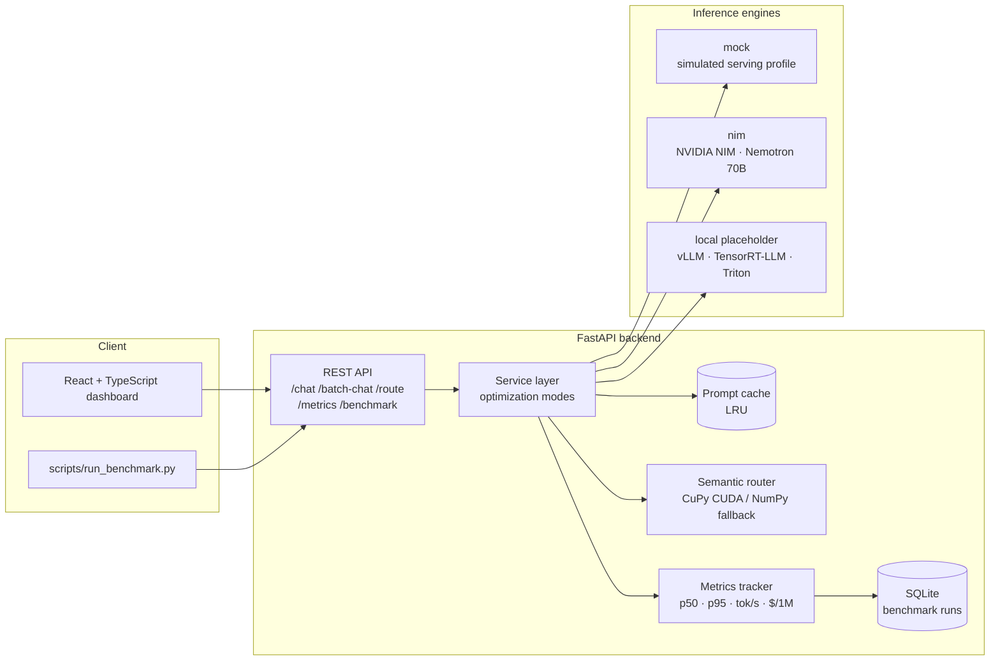

# InferEdge: GPU-Optimized LLM Inference Platform for Real-Time AI Agents

InferEdge is a full-stack platform for **benchmarking LLM inference optimization strategies** behind a real-time customer-support AI agent. It serves support prompts through five serving strategies — baseline, continuous batching, prompt caching, CUDA-accelerated semantic routing, and a quantization placeholder, and measures what actually matters in production inference: **time-to-first-token, p50/p95 latency, tokens/sec, requests/sec, and cost per 1M tokens**.

It runs entirely locally in **mock mode** (no GPU, no API key), and flips to real **NVIDIA NIM / Nemotron** inference with one environment variable.

## Read this first: where the numbers come from

InferEdge is a **benchmarking harness**, and it has two sources of numbers:

- **Simulated serving profile (mock mode).** The headline comparison numbers below come from a simulator. Each model tier has a time-to-first-token and a per-token decode rate modeled on 8B-class and 70B-class GPU serving. That let me compare optimization strategies cheaply and reproducibly, with no GPU bill and no rate limits. The *ratios* between strategies are the point; the absolute milliseconds are the simulator's assumptions, not measurements of real hardware.
- **Real hosted inference (NIM mode).** The same harness runs unchanged against NVIDIA's hosted NIM endpoints: Llama 3.1 Nemotron 70B for the large tier and Mistral-NeMo-Minitron 8B for the small tier. Responses are streamed, so time-to-first-token is measured from the first content chunk rather than estimated.

Two more things to know when reading the results:

- **Costs are estimates.** They use assumed per-token list prices (see `MODEL_TIERS` in `backend/app/config.py`). The free build.nvidia.com tier charges nothing.
- **Some paths are not exercised on every machine.** `quantized` is simulator-only, and the API refuses it in NIM mode because hosted NIM has no quantization toggle. The router's CUDA path (CuPy) needs an NVIDIA GPU; on a machine without one, the router benchmark reports CPU fallback timings only.

## Architecture



**Request flow:** a prompt hits `/chat` with an optimization mode → the service layer consults the prompt cache and/or semantic router → the router classifies intent on GPU (CuPy/cuBLAS) or CPU (NumPy fallback) and picks a model tier (8B-class vs 70B-class) → the selected engine generates → every request is logged with full latency/token/cost metrics.

## Optimization modes benchmarked

| Mode | What it does | What it demonstrates |
|---|---|---|
| `baseline` | Sequential single requests to the large model | The control group |
| `batching` | Requests share the decode loop concurrently | Continuous batching → ~5x throughput |
| `caching` | Exact-match LRU cache in front of the engine | Hot-FAQ traffic → ~75% cache hits, near-zero p50 |
| `routing` | Semantic router sends easy intents to a small model | ~60% cost reduction, ~2.8x p50 speedup |
| `quantized` | Simulated INT8/FP8 serving profile | Placeholder for a TensorRT-LLM quantized engine |

Simulated serving profile (mock mode), 50 prompts (`scripts/run_benchmark.py`):

```
mode        reqs  wall(s)   req/s  p50(ms)  p95(ms)  ttft(ms)    tok/s    $/1M tok  cache
baseline      50    29.61    1.69   580.01   668.24     85.74   133.80     1.2644      -
batching      50     5.49    9.11   706.48   826.60     86.40   110.72     1.2644      -
caching       50     7.32    6.83     0.05   648.67     21.50   127.52     0.3076    76%
routing       50    15.28    3.27   209.70   665.63     46.19   328.65     0.4939      -
quantized     50    18.98    2.63   383.10   432.00     58.86   209.52     1.2644      -
```

## Quickstart (mock mode — no GPU, no API key)

### Backend

```bash
cd backend
python3 -m venv .venv
.venv/bin/pip install -r requirements.txt
.venv/bin/uvicorn app.main:app --port 8000        # http://localhost:8000/docs
```

### Frontend (requires Node 18+)

```bash
cd frontend
npm install
npm run dev                                        # http://localhost:5173
```

### Benchmark CLI

```bash
# with the backend running:
backend/.venv/bin/python scripts/run_benchmark.py --num-prompts 50
# results land in benchmark_results/*.json and *.csv
```

### Tests

```bash
cd backend && .venv/bin/python -m pytest tests/ -v
```

### Docker (backend + dashboard in one command)

```bash
docker compose up --build
# dashboard: http://localhost:3000   API: http://localhost:8000/docs
```

## Using real NVIDIA NIM / Nemotron inference

1. Get a free API key at [build.nvidia.com](https://build.nvidia.com).
2. `cp .env.example .env` and set (the backend reads `.env` on startup; real environment variables take precedence):

```bash
INFERENCE_MODE=nim
NVIDIA_API_KEY=nvapi-...
NVIDIA_NIM_MODEL=nvidia/llama-3.1-nemotron-70b-instruct
NVIDIA_NIM_SMALL_MODEL=nvidia/mistral-nemo-minitron-8b-8k-instruct
```

3. Restart the backend and run the benchmark (`quantized` is skipped automatically in NIM mode):

```bash
backend/.venv/bin/python scripts/run_benchmark.py --num-prompts 50
```

Routed small-tier traffic goes to Mistral-NeMo-Minitron 8B, NVIDIA's pruned and distilled 8B model; everything else goes to Nemotron 70B. The metrics, benchmarks, and dashboard work unchanged. The NIM client is built for the free tier's rate limits: it caps in-flight requests (`NIM_MAX_CONCURRENCY`, default 4) and retries 429/5xx responses with exponential backoff.

## The CUDA semantic router

`backend/app/routing/semantic_router.py` classifies prompts into six support intents (billing, technical_support, account_management, refund, shipping, human_escalation) and maps each to a model tier.

- **Embeddings:** deterministic hashed random-projection vectors (384-dim) — a dependency-free stand-in with the same interface as a real encoder (swap in NeMo Retriever / sentence-transformers in one function).
- **Scoring:** cosine similarity against category centroids — dense matmuls that run as **cuBLAS kernels via CuPy** on an NVIDIA GPU, with an automatic **NumPy CPU fallback** ("CPU fallback mode") when no GPU is present.
- **CPU vs GPU benchmark:** `POST /router/benchmark` scores thousands of intents on both backends (with warm-up and explicit `cudaStreamSynchronize` so timings are honest) and reports the speedup. The dashboard has a one-click button for it.

```bash
# on a GPU machine:
pip install cupy-cuda12x   # router switches to CUDA automatically
```

## API surface

| Endpoint | Description |
|---|---|
| `POST /chat` | One prompt through a chosen mode (`baseline`, `caching`, `routing`, `quantized`) |
| `POST /batch-chat` | A list of prompts served as one concurrent batch |
| `POST /route` | Classify a prompt: category, confidence, per-category scores, model tier |
| `POST /router/benchmark` | CPU vs GPU similarity-scoring benchmark |
| `POST /benchmark/run` | Full benchmark across optimization modes (persisted to SQLite) |
| `GET /benchmark-results` | Saved benchmark runs |
| `GET /metrics` | Rolling p50/p95 latency, tokens/sec, req/s, cost/1M tokens, cache stats |
| `GET /sample-prompts` | The customer-support prompt suite |

Interactive docs at `/docs` (OpenAPI/Swagger).

## Where the production NVIDIA stack plugs in

The `local` engine (`backend/app/inference/local_engine.py`) is the documented seam for a self-hosted serving stack — the rest of the platform needs zero changes:

- **vLLM** — OpenAI-compatible endpoint with continuous batching and automatic prefix caching (the real versions of the `batching` and `caching` modes here).
- **TensorRT-LLM** — compiled engines with INT8/FP8 quantization (the real `quantized` mode) and **speculative decoding** (draft model / Medusa heads) for TTFT and tokens/sec gains.
- **Triton Inference Server / NVIDIA Dynamo** — production serving: dynamic batching policies, multi-GPU scheduling, and KV-cache-aware routing (the production version of the semantic router's tiering decision).
- **Streaming TTFT** — the NIM engine currently approximates TTFT from total latency; switching to SSE streaming and timing the first chunk is the drop-in upgrade.

## Project structure

```
backend/
  app/
    main.py               FastAPI app + endpoints
    service.py            optimization-mode orchestration
    benchmark.py          benchmark runner (traffic shapes per mode)
    metrics.py            rolling metrics tracker (p50/p95, tok/s, $/1M)
    db.py                 SQLite persistence for benchmark runs
    config.py             env config + model-tier pricing
    sample_prompts.py     customer-support prompt suite
    inference/
      engine.py           engine abstraction + factory
      mock_engine.py      simulated serving profiles (default)
      nim_engine.py       NVIDIA NIM / Nemotron client
      local_engine.py     vLLM/TensorRT-LLM/Triton placeholder
      prompt_cache.py     LRU response cache
    routing/
      semantic_router.py  CUDA (CuPy) / CPU (NumPy) intent router
  tests/test_api.py       API + router tests (mock mode)
  tests/test_nim_engine.py  NIM client tests: streaming TTFT, retries, fallbacks
frontend/                 React + TypeScript + Vite dashboard
scripts/run_benchmark.py  benchmark CLI (JSON/CSV output + summary table)
docker-compose.yml        backend + dashboard
```
